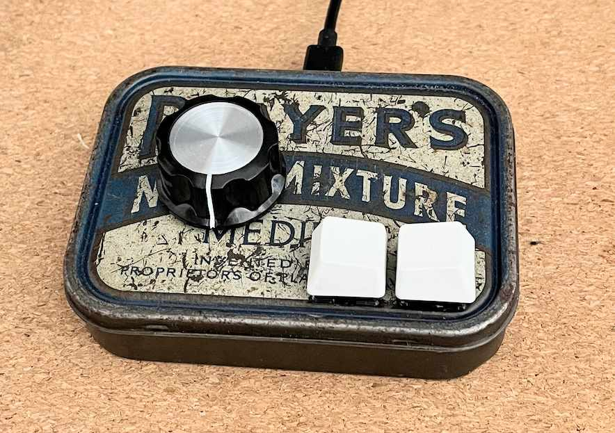

# USB Volume Knob

This is a small project that uses CircuitPython to create a simple USB volume knob. The knob supports play/pause functionality on short presses, and I added 2 keys to skip to the previous/next track. This is my first project using [circuitpython](https://circuitpython.org/) and I absolutely loved it.

I used this code on a bootleg ProMicro (rp2040) to have a "proper" physical volume knob and media buttons on my desk, enclosed in an old tin box I found at a thrift shop.

## Implementation details

- The `boot.py` file will disable the usb mass storage, usb MIDI, serial port and extra HID peripherals at startup unless the PLAYPAUSE button is pressed.
- The `pins.py` file contain the mapping between the physical GPIO pins and their labels. 
- You will need the adafruit_hid, adafruit_debouncer and adafruit_ticks [libraries](https://circuitpython.org/libraries).

## Features

- **Volume Control**: The knob allows you to control the volume of your device.
- **Play/Pause**: A short press on the knob will play or pause the current track.
- **Next/Previous Track**: A press on the previous and next buttons will go to the previous/next track.

## License

This project is licensed under the GPL. Please see the `LICENSE` file for more information. 

## Support

If you encounter any problems or have any suggestions, please open an issue on this repository. 

## Acknowledgements

This project was made possible by the CircuitPython community and their excellent libraries. Thank you!
